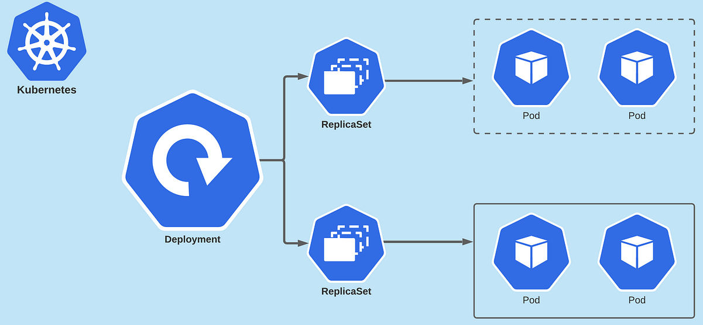

# DotNet Application with Kubernetes

## Motivation

This project was developed to learn and improve knowledge about Kubernetes and the benefits of using it in our applications.

## Application

The application is very simple and was developed using the new dotnet technologies:

- NET 7
- EF Core

And using PostgresSQL to database.

To monitoring the application, was applied the health checks to application and database, and the UI insterface to better view. To check in your localhost click [here](http://localhost:5000/health) or here to see the dashboard [here](http://localhost:5000/dashboard)

The endpoints are accessible to the [swagger](http://localhost:5000/swagger) and [redoc](http://localhost:5000/redoc).

Was applied the DDD concepts, using a rich entity and the hexagonal architecture.

## Kubernetes

The application and database are in k8s scripts to build the structure. All scripts are present in the `k8s` folder.
For the app, there are a few different ways to build, each with its benefits:

- Deployment
- ReplicaSet
- HPA

### Deployment

Are a fundamental feature in Kubernetes for managing containerized applications. They provide a declarative way to specify the desired state of a set of pods, abstracting the complexities of scaling and updating. Deployments use a Pod template to define the configuration for application pods, including container images, ports, and environment variables.

With Deployments, users can perform rolling updates, replacing old pods with new ones gradually to ensure minimal downtime during application updates. They also enable easy horizontal scaling by adjusting the number of desired replicas. Deployments contribute to application reliability by automatically restarting pods that fail health checks. Additionally, they offer version control, enabling quick rollbacks to a previous known working state. In essence, Kubernetes Deployments simplify application management and maintain the desired application state, ensuring smooth operations in containerized environments.

<p align="center">
  
</p>

### ReplicaSet

Is a resource used to ensure that a specified number of identical pods are running at all times. It provides high availability and fault tolerance by continuously monitoring the actual number of replicas and automatically creating or terminating pods to maintain the desired state. ReplicaSets are defined using label selectors to identify the pods they manage, allowing them to handle replication for various applications within a cluster. While Kubernetes Deployments are commonly used for more advanced rollout strategies, ReplicaSets remain essential for basic replication needs and are often utilized in conjunction with other controllers to achieve specific application behaviors.

### HPA - Horizontal Pod Autoscaling

Is a resource used for automated scaling of applications based on their resource utilization. The HPA monitors the CPU utilization or custom metrics of a selected deployment or replica set and dynamically adjusts the number of replicas (pods) to match the desired metric target.

The HPA ensures that the application can handle varying levels of traffic and workload demands by automatically scaling up or down the number of pods. If the CPU or custom metric exceeds a predefined threshold, the HPA will increase the number of replicas to distribute the load. Conversely, if the resource usage decreases, the HPA will scale down the replicas to optimize resource utilization and reduce costs.

<p align="center">
  
</p>

## Use

To run you need Docker and Kubernetes installed, for this, go to [documentation](https://kubernetes.io/docs/setup/):

## Docker Compose

For a simple test, use docker compose to check the environment

Build the local application image `docker build -t dotnet.salesad.app app/`

To build the resources, run `docker-compose up -d` and check if all containers are running `docker ps`. Nice, now go to [link](http://localhost:5000/dashboard) to health check.

To remove the docker-compose resources, run `docker-compose down`.

## Kubernetes

Let's use k8s

### Database

Open your terminal, and go to k8s folder and run command `kubectl apply -f db.yaml`

To check if everything is ok, run `kubectl get pods` and see if the terminal output looks like this:

```console
NAME                          READY   STATUS    RESTARTS       AGE
postgresdb-67796df68f-z8h4l   1/1     Running   1 (112m ago)   44h
```

To remove the pods use `kubectl delete -f db.yaml`;

### Application

To start using HPA, first you need to install metrics so that Kubernetes gets CPU and memory usage, so in k8s folder, run: `kubectl apply -f metrics.yaml`.

in a few seconds the metrics will start working, to check if it's ok, run: `kubectl top nodes`, and you should get an output like this:

```console
NAME             CPU(cores)   CPU%   MEMORY(bytes)   MEMORY%
docker-desktop   502m         3%     2899Mi          37%
```

Open your terminal, and go to k8s folder, choose which structure to start, for example build the HPA, for this, run `kubectl apply -f app-hpa.yaml`.

To check if everything is ok, run `kubectl get pods` and see if the terminal output looks like this:

```console
NAME                          READY   STATUS    RESTARTS       AGE
postgresdb-67796df68f-z8h4l   1/1     Running   1 (119m ago)   44h
salesadapi-b5f66ffd-58696     1/1     Running   0              5s
```

To remove the pods use `kubectl delete -f app-hpa.yaml`;

To check if the application is running, access the [link](http://localhost:5000/dashboard).

Check the operation of the HPA, run `kubectl get hpa`:

```console
NAME      REFERENCE               TARGETS   MINPODS   MAXPODS   REPLICAS   AGE
app-hpa   Deployment/salesadapi   1%/40%    1         10        1          2m17s
```

## k6 Stress Test

Let's put HPA to work, run the stress test, for that you need to install k6 on your machine, see de [k6 documentation](https://k6.io/docs/get-started/installation/)

Installed, access the folder `k6-stress-test` and execute `k6 run stress-test.js`.

Verify that the HPA starts new replicas to support the number of requests:

Run `kubectl get hpa`:

```console
NAME      REFERENCE               TARGETS    MINPODS   MAXPODS   REPLICAS   AGE
app-hpa   Deployment/salesadapi   169%/40%   1         10        4          8m14s
```

After finish the strees test, it will take about 5 minutes to remove the pods, this is known as the cooldown delay.
